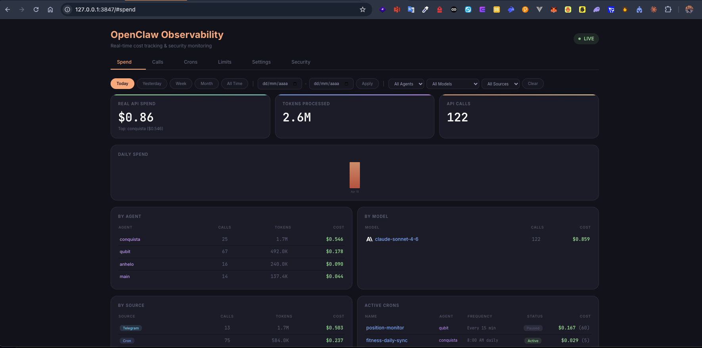

# 0xAI OpenClaw Guardian

Real-time observability, **cost tracking**, **kill-switches** and configuration dashboard for [OpenClaw](https://openclaw.ai) AI agent deployments.

[](https://www.npmjs.com/package/0xai-openclaw-guardian)
[](https://www.npmjs.com/package/0xai-openclaw-guardian)
[](./LICENSE)
[](https://nodejs.org)
[](https://github.com/sponsors/0xAI-Builders)
[](https://buymeacoffee.com/0xjesus)

- 🔍 Intercepts **every AI call** from OpenClaw to any provider (Anthropic, OpenAI, Google, OpenRouter, Groq, Cerebras, xAI, Ollama, HuggingFace)
- 💰 Real per-call cost calculation via **noosphere** pricing catalog (45+ models, auto-synced)
- 🛡 **Kill-switches**: USD caps (daily/weekly/monthly), per-agent/per-model caps, rate limits for zero-cost providers (ollama), loop detector, emergency pause
- 📊 Dashboard at `http://localhost:3847` with tabs: **Spend · Calls · Crons · Limits · Settings · Security**
- 🔗 Stateful: SQLite-backed `calls.db` for live queries and aggregations
- 🪙 Subscription-aware: shows **SUB vs API** per call, always prints the API-equivalent cost (even for Claude Max)



> Real-time spend breakdown by agent, model, and source. API-equivalent cost is displayed even for subscription (Claude Max) calls, so you always see the economic value consumed.

---

## Install

Zero setup if you just want to run it:

```bash
# Global CLI
npm install -g openclaw-observability
openclaw-obs

# Or without install
npx openclaw-observability
```

Then open **http://localhost:3847** in your browser.

The proxy starts automatically on `http://127.0.0.1:18801` the first time it detects Claude credentials at `~/.claude/.credentials.json`.

---

## Wire it into OpenClaw

Edit `~/.openclaw/openclaw.json` so each provider's `baseUrl` points at the local proxy. That makes every call route through observability, pricing, kill-switches, and the logger.

```json
{
  "models": {
    "providers": {
      "anthropic": { "baseUrl": "http://127.0.0.1:18801" },
      "openai":    { "baseUrl": "http://127.0.0.1:18801/openai/v1" },
      "google":    { "baseUrl": "http://127.0.0.1:18801/google" },
      "openrouter":{ "baseUrl": "http://127.0.0.1:18801/openrouter/v1" },
      "groq":      { "baseUrl": "http://127.0.0.1:18801/groq/openai/v1" },
      "cerebras":  { "baseUrl": "http://127.0.0.1:18801/cerebras/v1" },
      "xai":       { "baseUrl": "http://127.0.0.1:18801/xai/v1" },
      "ollama":    { "baseUrl": "http://127.0.0.1:18801/ollama", "api": "ollama" }
    }
  }
}
```

Restart the OpenClaw gateway so the new `baseUrl`s take effect.

---

## Environment variables

All optional.

| Variable | Default | Description |
|---|---|---|
| `OPENCLAW_DIR` | `~/.openclaw` | Path to your OpenClaw directory |
| `OBS_PORT` | `3847` | Dashboard server port |
| `OBS_HOST` | `0.0.0.0` | Bind address |
| `OBS_LIMITS_FILE` | `$OPENCLAW_DIR/observability/limits.json` | Spend + rate limit config |
| `OBS_BILLING_PROXY_AUTOSTART` | `1` | Start the proxy on boot when Claude creds are present |
| `OBS_BILLING_PROXY_PORT` | `18801` | Proxy port (all providers multiplex here) |
| `OBS_BILLING_PROXY_HOST` | `127.0.0.1` | Proxy bind address |

---

## Dashboard tabs

### 💸 Spend
Historical spend aggregated by agent / model / source / day / cron. Reads from session JSONL files. Works even for subscription calls (API-equivalent cost is always computed).

### 📋 Calls
Every single call captured by the proxy, live. Filters: provider, model, billing mode (SUB/API). Columns:

| Col | Meaning |
|---|---|
| Time | local timestamp |
| Provider / Model | who served the call |
| Agent | derived from request body / openclaw.json whitelist |
| Query | last user message (tooltip has full text) |
| In / Out / Cache / Total | token counts |
| Cost / $/1k | API-equivalent USD |
| Lat | round-trip latency |
| Billing | **SUB** (subscription plan) or **API** (pay-per-token) |

### ⏰ Crons
List every OpenClaw cron with schedule, agent, last-run status, consecutive errors. Enable/disable or **permanently delete** any cron from the UI.

### 🛡 Limits — Kill-switches
Edit `~/.openclaw/observability/limits.json` with a form. Proxy hot-reloads on mtime change.

- **Emergency pause** — single-click kill-switch. Auto-saves immediately. Sticks a red banner across the dashboard while active.
- **Global USD caps** — daily / weekly / monthly. Blocks upstream requests with HTTP 429 when exceeded. Does NOT trigger for zero-cost providers (see next).
- **Rate + token caps** per provider — required for Ollama / local inference. Supports `callsPerMinute`, `callsPerHour`, `callsPerDay`, `tokensPerDay`.
- **Loop detector** — if any single session makes more than N calls in X seconds, further calls are auto-blocked.

Example `limits.json`:

```json
{
  "enabled": true,
  "paused": false,
  "global": { "dailyUsd": 10, "weeklyUsd": 50, "monthlyUsd": 200 },
  "perAgent":  { "anhelo": { "dailyUsd": 3 } },
  "perModel":  { "claude-opus-4-6": { "dailyUsd": 5 } },
  "rateLimits": {
    "perProvider": {
      "ollama": { "callsPerMinute": 120, "callsPerHour": 2000, "tokensPerDay": 50000000 }
    }
  },
  "loopDetector": { "enabled": true, "windowSec": 60, "maxCalls": 30 }
}
```

### ⚙️ Settings
Select each agent's model. Toggle crons. Inspect provider connectivity.

### 🔐 Security
Audit: exposed secrets in config files, file permissions, encryption status.

---

## REST API

All endpoints are local, no auth needed (bind to loopback by default).

| Method | Path | Purpose |
|---|---|---|
| GET | `/api/dashboard` | Spend aggregate for range/filters |
| GET | `/api/calls?from&to&provider&agent_id&model&limit&offset` | Paginated call log |
| GET | `/api/calls/aggregate?by=provider|model|agent_id` | Roll-up stats |
| GET | `/api/limits` | Current limits + spend snapshot |
| POST | `/api/limits` | Atomic write to `limits.json` |
| GET | `/api/crons` | List every cron, enabled or not |
| POST | `/api/crons/:id/toggle` | `{enable:true|false}` |
| DELETE | `/api/crons/:id` | Permanent delete |
| GET | `/api/billing-proxy` | Proxy health + guard snapshot |
| GET | `/api/security` | Security audit |

---

## Deep-linkable URLs

Every tab and section has a hash slug. Hover any heading to reveal a 🔗 icon — click to copy a shareable URL.

```
#spend
#calls              #calls/filters
#crons
#limits             #limits/caps       #limits/loop        #limits/rates
#settings
#security
```

---

## Kill-switch codes

When the proxy blocks a request it returns HTTP 429 with a structured payload. Useful for debugging and alerting:

| Code | Trigger |
|---|---|
| `paused` | Emergency switch is ON |
| `global_daily_cap` · `global_weekly_cap` · `global_monthly_cap` | Global USD cap reached |
| `agent_daily_cap` · `model_daily_cap` · `provider_daily_cap` | Per-dimension USD cap |
| `loop_detected` | Session fired too many calls too fast |
| `provider_rpm_cap` · `provider_rph_cap` · `provider_rpd_cap` | Rate-limit for zero-cost provider |
| `provider_tpd_cap` · `agent_id_tpd_cap` · `model_tpd_cap` | Token-budget cap |

---

## How costs are computed

- Pricing table comes from [noosphere](https://www.npmjs.com/package/noosphere) (`@mariozechner/pi-ai` generated catalog, ~45 models) plus a small fallback table.
- For subscription calls (e.g. Claude Max) the proxy still prices at API rates, so the dashboard shows the **economic value consumed** even though nothing is charged.
- Google uses the double-counting-safe formula: `uncached = input − cacheRead`.
- Ollama / local inference is always priced at $0. Those providers are protected by rate limits instead.

---

## Hooks (optional, for auto-launch)

Copy the 3 hook handlers into your OpenClaw hooks directory to automate startup and spend enforcement:

```bash
mkdir -p ~/.openclaw/hooks/{observability,spend-guard,model-guard}
cp node_modules/openclaw-observability/hooks/observability/handler.ts ~/.openclaw/hooks/observability/
cp node_modules/openclaw-observability/hooks/spend-guard/handler.ts   ~/.openclaw/hooks/spend-guard/
cp node_modules/openclaw-observability/hooks/model-guard/handler.ts   ~/.openclaw/hooks/model-guard/
```

| Hook | Trigger | Effect |
|---|---|---|
| **observability** | Gateway startup | Launches the dashboard server |
| **spend-guard** | Before each agent turn | Rejects the call if caps are breached |
| **model-guard** | Before each agent turn | Prevents drift to more expensive models |

---

## Security notes

- The proxy binds to loopback (`127.0.0.1`) by default. Do **not** expose it publicly — it relays OAuth tokens.
- `~/.claude/.credentials.json` is read in-memory; never logged or echoed.
- `limits.json` and `calls.db` live inside `~/.openclaw/observability/`. The repo `.gitignore` excludes every user-specific directory.
- Run `git log -p` against this repo to verify: zero secrets committed.

---

## Development

```bash
git clone https://github.com/<your-org>/openclaw-observability
cd openclaw-observability
npm install
node bin/cli.mjs
```

Source layout:

```
src/
├── server.mjs           # Dashboard HTTP + REST API
├── billing-proxy.mjs    # Anthropic proxy (OAuth rewriting)
├── multi-provider.mjs   # Generic router for OpenAI/Google/Ollama/etc
├── usage-parser.mjs     # Per-provider token extractor
├── logger.mjs           # SQLite call log (better-sqlite3, JSONL fallback)
├── guards.mjs           # Kill-switch evaluator (caps + rate + loop detector)
├── pricing.mjs          # noosphere-backed cost calculator
└── dashboard.html       # Single-file SPA, Tailwind + vanilla JS
```

## License

MIT
